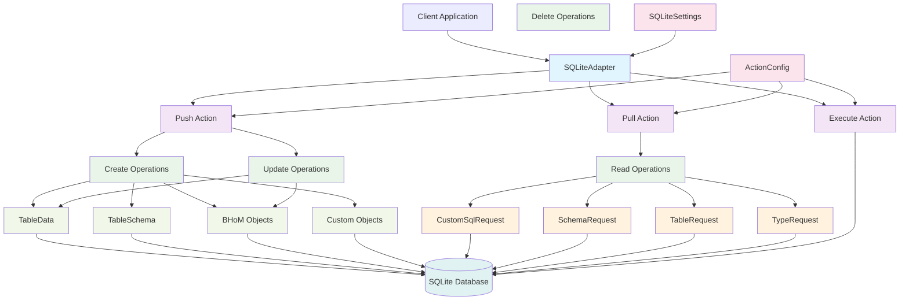

# SQLite Adapter Architecture

This diagram shows how the SQLite_Adapter works within the BHoM framework, illustrating the data flow and component interactions.

## Key Components

### 1. **SQLiteAdapter (Main Class)**
- Inherits from `BHoMAdapter`
- Manages database connection lifecycle
- Handles SQLite-specific settings and configuration
- Maintains connection state and diagnostics

### 2. **Adapter Actions (Public Interface)**
- **Push**: Sends BHoM objects to SQLite database
- **Pull**: Retrieves data from SQLite database based on requests
- **Execute**: Executes commands like Open, Close, Custom operations

### 3. **CRUD Operations**
- **Create**: Creates tables, schemas, and inserts data
- **Read**: Handles various request types (Custom SQL, Schema, Table)
- **Update**: Modifies existing data
- **Delete**: Removes data from database

### 4. **Data Objects (Push Operations)**
- **TableData**: Contains table data and schema for insertion
- **TableSchema**: Database table structure definition
- **BHoM Objects**: Standard BHoM object types (Nodes, Elements, etc.)
- **Custom Objects**: User-defined custom objects

### 5. **Request Objects (Pull Operations)**
- **CustomSqlRequest**: Executes custom SQL queries
- **SchemaRequest**: Retrieves database schema information
- **TableRequest**: Fetches data from specific tables
- **TypeRequest**: Type-specific data retrieval

### 6. **Configuration Objects**
- **SQLiteSettings**: Database-specific configuration
- **ActionConfig**: Action-specific configuration

## Data Flow

1. **Push Flow**: Client → Push Action → CRUD Create/Update → Data Objects (TableData, TableSchema, BHoM Objects) → SQLite Database
2. **Pull Flow**: Client → Pull Action → CRUD Read → Request Objects → SQLite Database
3. **Execute Flow**: Client → Execute Action → Command Objects → SQLite Database

## Key Features

- **Connection Management**: Handles SQLite connection lifecycle
- **WAL Mode Support**: Write-Ahead Logging for better performance
- **Type Safety**: Strongly typed request and response objects
- **Error Handling**: Comprehensive error recording and handling
- **Configuration**: Flexible settings for different use cases
- **BHoM Integration**: Seamless integration with BHoM object model